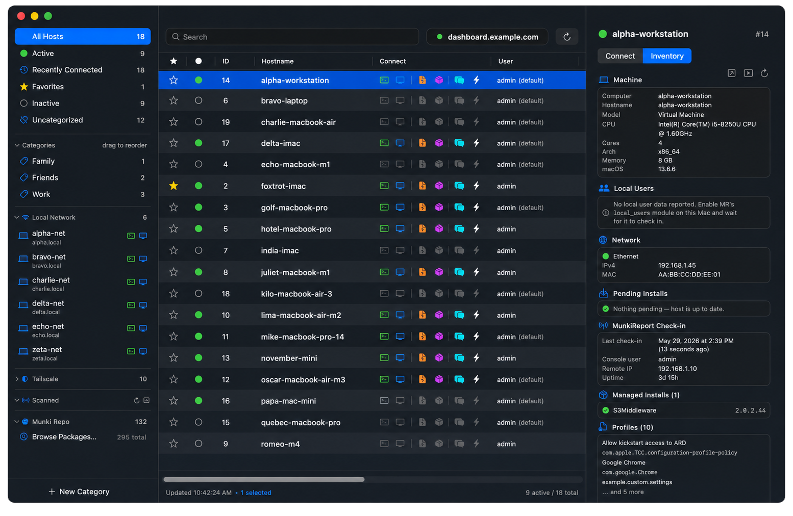
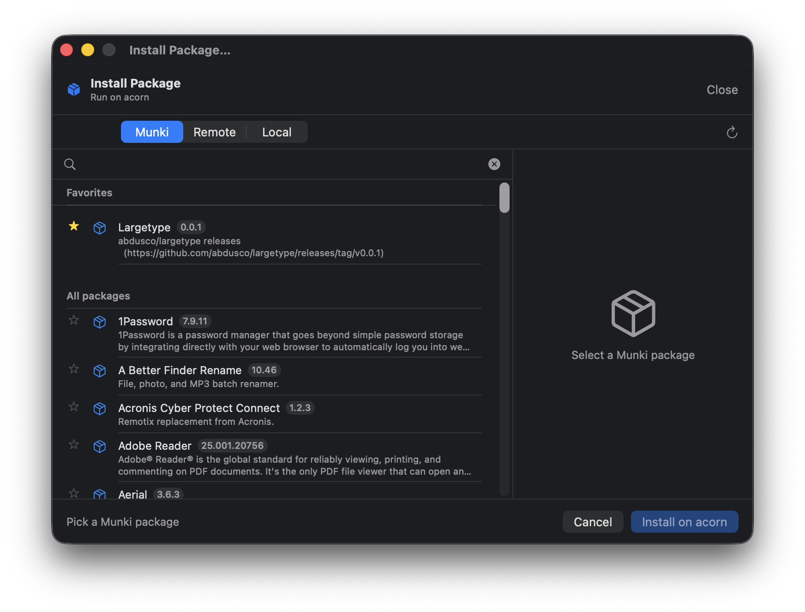
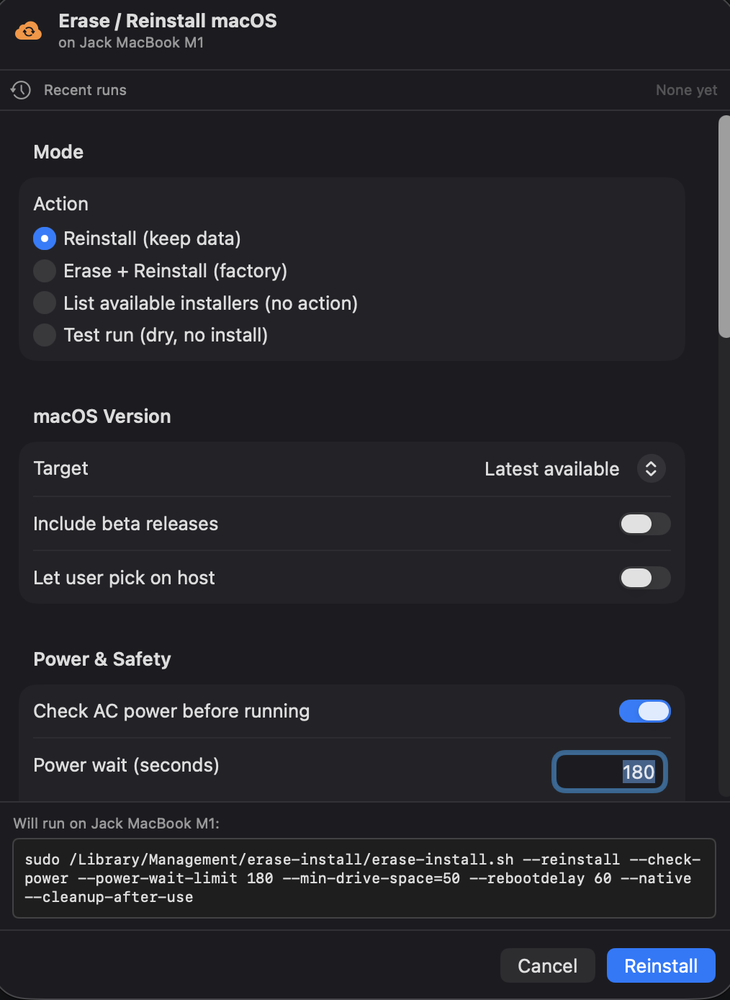
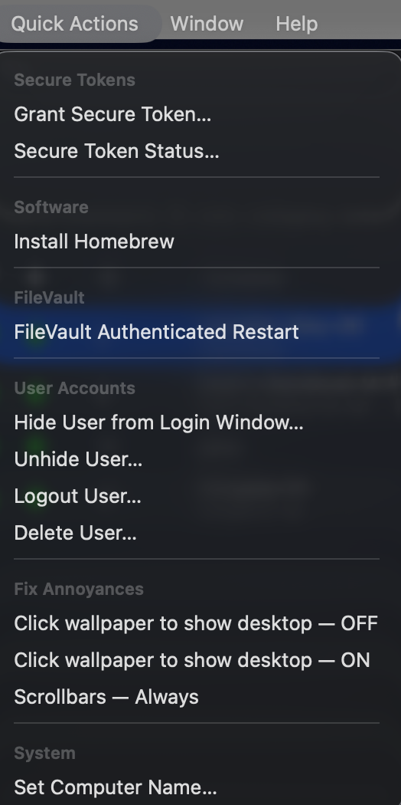

# BlueConnect Admin

A native macOS admin client for [BlueSkyConnect](https://github.com/BlueSkyTools/BlueSkyConnect) — the SSH reverse-tunnel concentrator used to remote-support a Mac fleet. Lists every registered host, shows which ones are currently tunneled, and connects via SSH / Screen Share (VNC) / file upload (SCP) with one click.



## Highlights

### Munki repo browser & installer · MunkiReport inventory in the side pane



Point the app at any S3-compatible Munki repo (Wasabi, AWS S3, Cloudflare R2, Backblaze B2, DigitalOcean Spaces) or a plain-HTTPS / HTTP-Basic-Auth-fronted server. Browse and search the catalog, right-click any package to drill into older versions, then deploy to one host or many via a multi-select picker.

The right-side pane has an **Inventory** tab that pulls MunkiReport data inline — machine info, last check-in, Munki run status, FileVault, disk, battery, managed installs. Backed by a tiny standalone `blueconnect_api.php` file that drops into MR's `public/` directory; no upstream module changes.

### Erase / Reinstall macOS, one structured sheet



Drives [Graham Pugh's `erase-install.sh`](https://github.com/grahampugh/erase-install) from a single dialog. Every flag the wiki documents is reachable, with defaults that match a typical fleet (`--check-power`, `--power-wait-limit 180`, `--min-drive-space=50`, `--cleanup-after-use`). Recent runs are saved — star one to pin it past the 10-entry rolling cap. Hostname-confirm gate before `--erase` so you can't fat-finger a factory wipe.

### Quick Actions — recipes for the things you type over and over



Top-level **Quick Actions** menu — or right-click any host → **Quick Actions** for the same list in context. Categories cover Secure Tokens (grant / status), User Accounts (hide / unhide / logout / delete), FileVault (authenticated restart), Software (Homebrew install), System (set computer name across all three macOS hostname slots), and Fix Annoyances (click-wallpaper-to-show-desktop toggle, scrollbars always visible). Each action shows the exact shell command before you run it, and Settings → Quick Actions lets you hide built-ins or add your own custom shell-command actions.

## Download

Grab the latest signed and notarized `.dmg` from the [Releases page](../../releases). Open the disk image and drag **BlueConnect Admin** into `/Applications`.

## Requirements

- A running [BlueSkyConnect](https://github.com/BlueSkyTools/BlueSkyConnect) server
- The five BlueConnect Admin PHP endpoints deployed on that server (see [Server setup](#server-setup))
- macOS 14 (Sonoma) or later
- An SSH key authorized on your BlueSkyConnect server
- BlueSky web admin credentials

## Server setup

The app has four integrations. Only **one is required** — the BlueSkyConnect endpoints. The other three (Direct Package Repo, Munki Repo, MunkiReport) are opt-in. Mix and match whatever you have.

| Integration | Required? | What you have to deploy server-side |
|---|---|---|
| **BlueSkyConnect endpoints** | **yes** — the app reads its host list from here | 5 small PHP files (`server/bs_*.php`) on your BSC server |
| **Direct Package Repo** | optional | One PHP file (`server/catalog.php`) in your `pkgs/` directory **OR** a static `catalog.json` |
| **Munki Repo (Wasabi/S3)** | optional | **Nothing.** Uses your existing S3-compatible bucket. Just enter credentials in Settings. |
| **MunkiReport API** | optional | One PHP file (`server/munkireport-module/blueconnect_api.php`) in your MR webroot + a token env var |

Quick recap of every file shipped under `server/`:

```
server/
├── bs_categories.json.php   ┐
├── bs_health.json.php       │  BSC endpoints — deploy as a group
├── bs_host_action.json.php  ├─ via deploy-server.sh
├── bs_host_update.json.php  │
├── bs_hosts.json.php        ┘
├── catalog.php              — Optional: drop in Direct Package Repo's pkgs/ dir
├── munkireport-module/
│   └── blueconnect_api.php  — Optional: drop in MunkiReport's public/ dir
└── migrations/              — Auto-run by BSC endpoints on first request
```

### 1. BlueSkyConnect endpoints (required)

Stock BlueSkyConnect ships an HTML admin UI but no JSON API. This Mac app needs five small read-mostly PHP endpoints (in `server/`) deployed once to your BSC server's web root. They don't change BSC's behavior — they translate the existing database state into JSON.

The fastest deploy is the included `deploy-server.sh`:

```sh
./deploy-server.sh <ssh-user>@<bsc-host> [ssh-port] [remote-path]
# defaults: ssh-port=22, remote-path=~/docker/stacks/bluesky
```

It scp's `server/*.php` and the `migrations/` directory to your BSC server. The categories migration runs idempotently on first request — no manual SQL needed.

Verify:

```sh
curl -i -u admin:$WEBADMINPASS https://<host>/bs_hosts.json.php
# expected: HTTP 200 with JSON body
```

If the app's login screen shows *"The server responded but doesn't have the BlueConnect Admin endpoints"*, that's the deploy step still missing.

### 2. Direct Package Repo (optional)

The simplest "Install Package" flow. You host `.pkg` / `.dmg` / `.app` installers somewhere with a JSON catalog listing them, and the app installs from those URLs over HTTPS. Good for hand-curated software where you control every file.

**Picking an upload service** (Settings → Package Repo → Upload service):

| Service | Auth | Best for |
|---|---|---|
| **SSH / SFTP** | SSH private key | Self-hosted shell server, any Linux box. |
| **FTP / FTPS** | Username + password (Keychain) | Legacy shared hosting, NAS units that only expose FTP. |
| **Nextcloud (WebDAV)** | Username + app password (Keychain) | Nextcloud or ownCloud servers with a folder share. |

**Hosting the catalog** — two flavors:

- **`server/catalog.php`** — drop into your `pkgs/` directory on a PHP-capable host. Set **Repo URL** in Settings to `https://your-host/path/catalog.php`. On every request it scans the directory and emits JSON for every `.pkg` / `.dmg` it finds. Optional `metadata.json` sidecar adds friendly names, groups, descriptions, icons, and destructive flags.
- **Static `catalog.json`** — generate locally with `tools/sync-catalog.sh` (rclone-based, works with any backend) and upload alongside the installers. Set **Repo URL** to `https://your-host/path/catalog.json`.

**Enriching with .pkg / .app metadata** — run `tools/extract-metadata.sh <pkgs-dir>` on the server (or locally) to pull `identifier`, `version`, and `title` out of every `.pkg`'s `PackageInfo` (`xar`) and every `.app`'s `Info.plist`. Merges into `metadata.json` without clobbering manual fields. Cron it for an always-fresh repo:

```cron
*/15 * * * * cd ~/path/to/pkgs && bash extract-metadata.sh . >/dev/null 2>&1
```

**Drop-to-install + drop-to-repo** — with a Package Repo configured, dropping a `.pkg` / `.dmg` / `.app` onto a host row both installs on the host **and** uploads the file to your repo so it shows up in the picker for next time. To upload without installing, use **Connect → Upload Package to Repo…** (⌘⇧U).

### 3. Munki Repo (optional)

If you already run a [Munki](https://www.munki.org) repo on an S3-compatible backend (Wasabi, AWS S3, Cloudflare R2, Backblaze B2, DigitalOcean Spaces) or behind a plain HTTPS / Basic-Auth-fronted server, the app browses and installs from it directly. **No server-side changes** — uses your existing bucket and credentials.

**Settings → Munki Repo:**

| Field | What to enter |
|---|---|
| **Endpoint host** | The S3 endpoint hostname, no scheme. E.g. `s3.us-west-1.wasabisys.com`, `s3.amazonaws.com`, `<account>.r2.cloudflarestorage.com`, or your custom CNAME like `munki.example.com`. |
| **Bucket** | The bucket name. Leave blank only when the endpoint *is* the bucket (custom CNAME pointing directly at the bucket). |
| **Repo prefix** | Path inside the bucket where the Munki repo lives. Common values: `munki_repo`, `repo`, or empty if `catalogs/`, `pkgs/`, `pkgsinfo/` sit at bucket root. |
| **Auth mode** | Pick one — see table below. |
| **Region** | Wasabi / AWS region (`us-east-1`, `us-west-1`, etc.) or `auto` for Cloudflare R2. Wrong region = `SignatureDoesNotMatch`. |
| **Access key + Secret key** | Your S3 credentials. Secret stored in macOS Keychain. |
| **Basic Auth user + password** | Only filled in for **Basic** or **Both** auth modes. |

**Auth modes** — match what's actually in front of your bucket:

| Mode | When to use |
|---|---|
| **S3 SigV4** | Direct to any S3-compatible storage. Most common — Wasabi, AWS, R2, B2, Spaces. |
| **None** | Plain HTTPS web server (Apache / nginx / Caddy / IIS) serving the Munki repo over HTTPS with no auth. |
| **HTTP Basic Auth** | A Cloudflare Worker or nginx in front of your bucket adds Basic Auth. The proxy handles SigV4 to S3 itself, so you don't need Wasabi keys in this mode. |
| **Both** | Passthrough proxy that requires Basic Auth from the client *and* forwards your SigV4 to S3 unchanged. |

The **"Will fetch:"** preview in Settings shows the exact `catalogs/all` URL the app will build from your inputs — typos in endpoint / bucket / prefix are immediately visible. **Test Connection** verifies before you commit. Pasting the wrong bucket is the usual mistake; `aws s3 sync` syntax (`s3://<bucket>/<prefix>`) tells you what to enter in **Bucket** and **Repo prefix**.

Once connected, the **Munki Repo** entry appears in the sidebar (collapsible) and a **Munki Repo** tab shows up in the Install Package picker. Right-click any package row to drill into older versions and install a specific build.

### 4. MunkiReport API (optional)

If you run [MunkiReport-php](https://github.com/munkireport/munkireport-php), the app can pull inventory directly from it — last check-in, OS version, model, FileVault status, last Munki run, managed installs, battery health, disk SMART. The data renders inline in the right pane under an **Inventory** tab when you select a host.

MunkiReport-php has no external REST API, so the app talks to a tiny standalone PHP file (`server/munkireport-module/blueconnect_api.php`) you drop into MR's webroot. The file reads MR's database directly via the same `CONNECTION_*` env vars MR already has set, gates everything behind a Bearer token, and degrades gracefully when optional MR modules aren't installed.

**1. Copy the PHP file** to wherever your MR container has its `public/` (or a bind-mounted subdir of it):

```bash
scp server/munkireport-module/blueconnect_api.php \
    user@mr-host:/path/to/munkireport/public/blueconnect_api.php
```

A common bind-mount layout puts host-side `public/` at `/var/munkireport/public/custom/` inside the container — that's fine, the file just ends up reachable under `/custom/blueconnect_api.php` instead of `/blueconnect_api.php` (the **API path** Settings field handles either layout).

**2. Generate a token and add it** to MR's env file:

```bash
TOKEN=$(openssl rand -hex 24)
echo "BLUECONNECT_API_TOKEN=$TOKEN" >> /path/to/munkireport/munkireport.env
docker compose up -d munkireport     # restart so the new env var is picked up
echo "Token: $TOKEN"                 # copy — you'll paste it into the app
```

> ⚠️ `docker compose restart` is NOT enough — it doesn't reload env vars. Use `up -d` to actually recreate the container with the new env.

**3. Verify from a shell** before pasting into the app:

```bash
curl -H "Authorization: Bearer $TOKEN" \
     https://munkireport.example.com/blueconnect_api.php?action=ping
# Or, for the /custom/ layout:
curl -H "Authorization: Bearer $TOKEN" \
     https://munkireport.example.com/custom/blueconnect_api.php?action=ping
# Expected: {"ok":true,"driver":"mysql"}   (or "sqlite")
```

**4. App-side** — Settings → MunkiReport:

| Field | Value |
|---|---|
| **MunkiReport server URL** | e.g. `https://munkireport.example.com` (no trailing slash) |
| **API token** | the value you generated above (stored in macOS Keychain) |
| **API path** | `blueconnect_api.php` (default) or `custom/blueconnect_api.php` (when MR's bind mount surfaces the file under `/custom/`) |

Then click **Test Connection**. Green = URL, token, and DB connection all working. From here, click any host that has a serial number → **Inventory** tab on the right pane populates automatically. Tab choice persists across launches.

#### What MunkiReport surfaces in the Inventory tab

Only sections your MR server actually has — missing modules are skipped silently:

- **Machine** — model, CPU, RAM, OS version, hostname
- **Check-in** — last check-in time (with relative ago), console user, remote IP, uptime
- **Munki** — last run type/time, error & warning counts (colored), manifest name
- **FileVault** — encryption status, recovery key escrow status, enabled users
- **Storage** — drive model, total/free, SMART status
- **Battery** — condition, cycle count, max capacity %, charge %, AC state
- **Managed Installs** — first 20 packages with checkmark for installed / dashed circle for pending, plus installed version

#### MunkiReport troubleshooting

| Symptom | Likely cause |
|---|---|
| `HTTP 503 — BLUECONNECT_API_TOKEN env var not set` | The env var didn't land on the running container. Re-run `docker compose up -d munkireport` after editing the env file; `docker compose restart` is NOT enough because it doesn't reload env. |
| `HTTP 401 — Authorization: Bearer <token> required` | nginx / reverse proxy is stripping the `Authorization` header. For nginx, add `proxy_pass_request_headers on;` (default) and confirm no `proxy_set_header Authorization "";`. For Cloudflare, no action needed. |
| `HTTP 403 — Invalid token` | Token mismatch between the app and the container env. Generate a fresh one, set both ends, retry. |
| `HTTP 404` | API path is wrong. If the file lives under `/custom/`, set the **API path** field to `custom/blueconnect_api.php`. |
| `HTTP 500 — DB connection failed` | The `CONNECTION_*` env vars on the container don't match what MR uses. The PHP file reuses MR's existing DB config — verify MR itself can reach the DB first. |
| Sections come back null for a host that should have data | That MR module isn't installed (the PHP file safe-catches missing tables). Install/enable the corresponding MR module — `filevault_status`, `disk_report`, `power`, `managedinstalls`, etc. — and the section will populate on next refresh. |

## First launch

The login window asks for:

- **Server URL** — your BlueSky web admin, e.g. `https://bluesky.example.com`
- **Username / Password** — the same credentials you use for the BlueSky web UI (stored in macOS Keychain)
- **Use Touch ID** — optional biometric unlock + auto-lock timer

Then open **Settings** (⌘,) and confirm:

- **SSH host** — the BlueSky server hostname
- **SSH port** — typically `3122`
- **Admin SSH key path** — e.g. `~/.ssh/bluesky_admin`
- **Default remote user** — typically `admin`

That's it — the host list populates from the server.

## Features

- **Built-in terminal** — every SSH connection opens in a tab right inside the app (SwiftTerm). No external Terminal.app, no window juggling. Detach a tab into its own floating window with the icon on the tab; re-attach with the button on the floating window.
- **Drag-and-drop file transfer** — drop a regular file onto any host row in the table and a Send File window pops up with the source pre-filled. One click and it's on the remote Mac.
- **Drag-and-drop install** — drop a `.pkg`, `.dmg`, or `.app` onto a host row and a dedicated Install Package window opens. Stepped checklist (Compress → Upload → Mount → Install → Clean Up), live `scp` percent, optional sudo password field. `.app` bundles are handled either as **Compress to DMG** (hdiutil locally, then mount/copy on the remote) or **Send Raw** (`scp -r` then `sudo mv` to /Applications).
- **Package Repo** — point Settings → Package Repo at a hosted catalog (your own server, Nextcloud share, GitHub Releases, etc.) and you get a searchable picker with grouped sections, descriptions, and per-package metadata (version, bundle ID, min macOS). Right-click a host → **Install Package…** to install one of those packages remotely; drop an installer into the picker to also push it to the repo.
- **Three upload services** for the repo: **SSH / SFTP** (SSH key auth), **FTP / FTPS** (user + password), **Nextcloud (WebDAV)** (server + app password). Pick one in Settings; the structured fields swap to match.
- **Send File window** — split-pane source/destination, live progress, ETA + transfer rate, quick-path destination buttons (Desktop / Downloads / Documents / Home / `/tmp`). After a successful transfer there's a **Copy file link** button that puts a clickable `file://` URL on your clipboard.
- **Local Network sidebar** — Bonjour discovers other Macs on your LAN with SSH and Screen Sharing enabled. One-click SSH or VNC, no tunnel needed.
- **Tailscale sidebar** — pulls peers from `tailscale status`, lists every reachable macOS / Linux machine across your tailnet. SSH and VNC icons. Bulk hide/show via the eye-slash button; right-click a peer → **Custom Connection…** to override user + SSH/VNC port per peer.
- **Touch ID lock** — biometric unlock with an auto-lock timer when the app is idle. Enable in Settings.
- **Menu bar extra** — globe icon up top with quick host shortcuts. Goes red when the server is unreachable.
- **Categories** — drag to reorder, drag hosts between them, sticky favorites and recents.


### Keyboard shortcuts

| Shortcut | Action |
|---|---|
| ⌘, | Open Settings |
| ⌘1 | Open SSH session to selected host |
| ⌘2 | Open VNC session to selected host |
| ⌘3 | Send File via SCP to selected host |
| ⌘4 | Install Package on selected host (opens the Install Package window) |
| ⌘⇧U | Upload Package to Repo… (no install) |
| ⌘⇧E | Erase / Reinstall macOS… for selected host |
| ⌘⇧M | Browse Munki Repo |
| ⌘F | Focus the host search field |
| ⌘R | Refresh host list |
| ⌘E | Export host list as CSV |
| ⌘A | Open Activity Log |
| ⌘D | Toggle favorite on selected host |
| ⌘S | Save host notes (when the right-pane notes field is dirty) |
| ⌘W | Close active terminal tab (never closes the main window) |
| ⌘\\ | Show Log |
| ⌘⇧L | Lock now (Touch ID re-required if enabled) |
| Esc | Close Settings window · clear the host search field |

## Building from source

```sh
git clone <this-repo>.git
cd BlueConnect-Admin
./build-app.sh
open "BlueConnect Admin.app"
```

`build-app.sh` runs `swift build -c release` and wraps the executable into a `.app` bundle for local use.

## Troubleshooting

### Sign-in fails with HTTP 404

The BSC server doesn't have the BlueConnect Admin PHP endpoints installed. Run the deploy:

```sh
./deploy-server.sh <ssh-user>@<bsc-host>
```

See [Server setup](#server-setup) for path overrides if your BSC layout puts the web root somewhere other than `~/docker/stacks/bluesky`.

### PHP files deployed but the app still says "endpoints missing"

The files probably landed one directory above Apache's docroot. In a typical sphen/bluesky container the docroot is `Server/html/` and files live at `Server/`. Move them:

```sh
mv .../Server/bs_*.json.php .../Server/html/
```

Verify with curl:

```sh
curl -i -u admin:$WEBADMINPASS https://<host>/bs_hosts.json.php
```

200 + JSON = good. Re-pass the deeper path next time:

```sh
./deploy-server.sh <user>@<host> 22 /usr/local/bin/BlueSkyConnect/Server/html
```

### Sign-in returns `{"error":"MYSQLROOTPASS not set on server"}`

The PHP loaded but couldn't read the MySQL root password from the container's environment. Most often this happens after pulling a fresh BSC image — env vars from the previous container don't carry over.

Check what the PHP can actually see:

```sh
docker exec <bluesky-container> cat /proc/1/environ | tr '\0' '\n' | grep -E 'MYSQLROOTPASS|WEBADMINPASS'
```

If `MYSQLROOTPASS` is missing, re-pass it in the container's environment (in `docker-compose.yml` under `environment:` for the bluesky service, or via `-e MYSQLROOTPASS=...` on `docker run`) and recreate the container. Note: PHP reads from `/proc/1/environ` because Apache strips environment vars in the request handler — passing it via Apache `SetEnv` won't work.

### Tailscale section says "CLI not found"

Install the [Tailscale CLI](https://tailscale.com/download). Either the Mac App Store / standalone app (`/Applications/Tailscale.app`) or `brew install tailscale` works. The app probes `/opt/homebrew/bin/tailscale`, `/usr/local/bin/tailscale`, and the App Store bundle.

### Tailscale peer connects on the wrong port

You're hitting the global default (22 for SSH, 5900 for VNC). Two ways to override:

- **All Tailscale peers**: Settings → Tailscale Defaults → SSH port / VNC port
- **One peer**: right-click the peer in the sidebar → **Custom Connection…** → set ports there. Per-peer overrides win over the global defaults.

The same screen has a User field if you need a different remote user for one peer.

## Support the project

If BlueConnect Admin saves you time, a tip is always appreciated.

[](https://buymeacoffee.com/echoparkbaby)

## License

[MIT](LICENSE) — © 2026 Brandon Walter.
