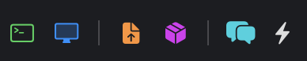

# BlueConnect Admin

A native macOS admin client for [BlueSkyConnect](https://github.com/BlueSkyTools/BlueSkyConnect), the SSH reverse-tunnel concentrator for remote-supporting a Mac fleet. Lists every registered host, shows which ones are tunneled, and connects via SSH, Screen Share (VNC), or file upload (SCP) with one click.


> [!IMPORTANT]
> **Upgrading from v1.2.x? Re-deploy the server-side PHP after updating the Mac app.**
> 
> v1.5.0 is the next public release after v1.2.0. Internal builds tagged 1.3 and 1.4 rolled into this one. v1.5.0 introduces:
>
> - a new `bs_blocklist.json.php` endpoint
> - a new `block` / `unblock` action in `bs_host_action.json.php` (auto-installs the `BlueSky.blocked_serials` table plus a `BEFORE INSERT` trigger that refuses re-registration of sold/transferred Macs)
> - an updated `blueconnect_api.php` covering seven more MunkiReport modules: local users, network, Wi-Fi, software updates, profiles, time machine, pending installs
>
> The Mac app upgrade alone doesn't pick those up. Push the new PHP files:
>
> ```sh
> ./deploy-server.sh <ssh-user>@<bsc-host>
> ```
>
> Then update the MunkiReport file separately. It lives on a different host than BSC:
>
> ```sh
> scp -P 2225 server/munkireport-module/blueconnect_api.php \
>     <user>@<mr-host>:~/<munkireport-stack>/public/
> ```
>
> On your BlueConnect server, install the Block Host Permanently sweeper:
>
> ```sh
> bash /bluesky/scripts/install-blocklist-cron.sh
> ```
>
> Runs every minute and scrubs any rogue row or key the `BEFORE INSERT` trigger missed.
>
> See [RELEASE_NOTES.md](RELEASE_NOTES.md) for the full v1.5.0 list: UniFi multi-profile, Install Package picker rework, MunkiReport Run Runner with live log, Munki favorites, and everything from the rolled-up 1.3 / 1.4 work.

## Contents

- [Highlights](#highlights)
  - [Per-host row buttons](#per-host-row-buttons)
  - [Quick Actions Browser](#quick-actions-browser-one-window-every-canned-admin-command)
  - [Munki repo browser & MunkiReport inventory](#munki-repo-browser--installer--munkireport-inventory-in-the-side-pane)
  - [Erase / Reinstall macOS](#erase--reinstall-macos-one-structured-sheet)
  - [Quick Actions](#quick-actions-recipes-for-the-things-you-type-over-and-over)
  - [Block Host Permanently](#block-host-permanently)
- [Download](#download)
- [Requirements](#requirements)
- [Server setup](#server-setup)
  - [1. BlueSkyConnect endpoints (required)](#1-blueskyconnect-endpoints-required)
  - [2. Remote Repo (optional)](#2-remote-repo-optional)
  - [3. Munki Repo (optional)](#3-munki-repo-optional)
  - [4. MunkiReport API (optional)](#4-munkireport-api-optional)
- [First launch](#first-launch)
- [Features](#features)
  - [Keyboard shortcuts](#keyboard-shortcuts)
- [Building from source](#building-from-source)
- [Troubleshooting](#troubleshooting)
- [Support the project](#support-the-project)
- [License](#license)

## Highlights

### Per-host row buttons



Every host row carries six one-click action buttons in the Connect column, grouped into three sets with thin dividers between them.

- **SSH** (terminal): open a shell in the bottom-pane terminal.
- **VNC** (display): open Screen Share over the SSH tunnel.
- **SCP** (orange file): pick a file from disk and land it on the host's Desktop.
- **Install** (purple box): open the Install Package window for this host (Munki, Remote, Local).
- **Chat** (speech bubbles): start a chat with whoever's at the screen. Requires the GUI Helper deployed on that Mac.
- **Quick Actions** (bolt): open the Quick Actions menu for this host.

The dividers separate **remote access** (SSH/VNC), **push to host** (SCP/Install), and **talk to user** (Chat/QA). Hide buttons or swap SF Symbol glyphs in **View → Customize Row Icons…**.

### Quick Actions Browser: one window, every canned admin command

![[set-computer-name.png]]

Open with ⌘K or **Quick Actions → Browse All Quick Actions…**. Pick a target host at the top, click any action on the left, and the right pane shows its description, parameters, and the exact shell command that will run. Star the ones you use most.

About 60 actions ship out of the box, all alphabetized. To run something against a single host without opening the browser, right-click the host and use the inline Quick Actions sheet.

### Munki repo browser & installer · MunkiReport inventory in the side pane


Point Settings → Munki Repo at any S3-compatible Munki repo (Wasabi, AWS S3, Cloudflare R2, Backblaze B2, DigitalOcean Spaces) or a plain-HTTPS / HTTP-Basic-Auth-fronted server. Browse and search the catalog, right-click any package to drill into older versions, then deploy to one host or many through a multi-select picker. Favorites pin packages by name, so a starred Firefox always tracks whatever version is newest in the repo.

The right pane has an **Inventory** tab that pulls MunkiReport data inline: machine info and last check-in. A tiny standalone `blueconnect_api.php` file backs it; drop it into MR's `public/` directory and no upstream module changes are needed. The arrow button in the section header opens that host's full MunkiReport page in your browser. The play button runs `munkireport-runner` on the host over SSH and streams the log as it runs.

### Erase / Reinstall macOS, one structured sheet


Drives [Graham Pugh's `erase-install.sh`](https://github.com/grahampugh/erase-install) from a single dialog. Every flag the wiki documents has a field, defaults tuned for the common fleet case (latest macOS, reinstall over erase, no test mode). The app keeps the last 10 runs so you can re-fire one without retyping; star a run to pin it past the rolling cap.

### Quick Actions: recipes for the things you type over and over


Top-level **Quick Actions** menu, or right-click any host → **Quick Actions** for the same list in context. Each category is a nested submenu so the top level scans cleanly. Favorited actions sit flat at the top. Every action previews the exact shell command before it runs. Settings → Quick Actions lets you hide built-ins or add your own shell-command actions.

### Block Host Permanently

For Macs you've sold or transferred whose BlueSky agent keeps phoning home: right-click → **Danger Zone → Block Host Permanently…**. Four things happen:

- The host's serial lands in a `BlueSky.blocked_serials` table (auto-created on first block).
- A `BEFORE INSERT` trigger on `computers` rejects any future registration with that serial at the DB layer.
- The same teardown as Delete runs: scrub `authorized_keys`, drop the row.
- A per-minute cron sweeper (`examples/bluesky/scripts/purge-blocked.sh`) catches any survivor that slips past the trigger.

Made a mistake? **Quick Actions menu → Blocked Hosts…** lists every blocked serial with a per-row **Unblock** button. The host reappears on its next agent reconnect.

## Download

Grab the latest signed and notarized `.dmg` from the [Releases page](../../releases). Open the disk image and drag **BlueConnect Admin** into `/Applications`.

## Requirements

- A running [BlueSkyConnect](https://github.com/BlueSkyTools/BlueSkyConnect) server
- The BlueConnect Admin PHP endpoints deployed on that server (see [Server setup](#server-setup))
- macOS 14 (Sonoma) or later
- An SSH key authorized on your BlueSkyConnect server
- BlueSky web admin credentials

## Server setup

Four integrations. Only the BlueSkyConnect endpoints are required. The other three (Munki Repo, Remote Repo, MunkiReport) are opt-in. Configure whichever ones you already have.

| Integration                  | Required?                                  | What to deploy server-side                                                                          |
| ---------------------------- | ------------------------------------------ | --------------------------------------------------------------------------------------------------- |
| **BlueSkyConnect endpoints** | **yes**, the app reads its host list here  | A small set of PHP files (`server/bs_*.php`) on your BSC server                                     |
| **Remote Repo**              | optional                                   | One PHP file (`server/catalog.php`) in your `pkgs/` directory, **or** a static `catalog.json`       |
| **Munki Repo (Wasabi/S3)**   | optional                                   | **Nothing.** Uses your existing S3-compatible bucket. Enter credentials in Settings.                |
| **MunkiReport API**          | optional                                   | One PHP file (`server/munkireport-module/blueconnect_api.php`) in your MR webroot plus a token env var |

Quick recap of every file shipped under `server/`:

```
server/
├── bs_auth.php                  ┐
├── bs_blocklist.json.php        │
├── bs_categories.json.php       │  BSC endpoints + shared HTTP-Basic
├── bs_health.json.php           │  helper — deploy as a group via
├── bs_host_action.json.php      ├─ deploy-server.sh
├── bs_host_update.json.php      │  (bs_host_action gained block/unblock
├── bs_hosts.json.php            │   actions in v1.3.0 — see Block Host
├── bs_authkeys_audit.json.php   ┘   Permanently above)
├── catalog.php                   Optional: drop in Direct Package Repo's pkgs/ dir
├── munkireport-module/
│   └── blueconnect_api.php       Optional: drop in MunkiReport's public/ dir.
│                                  Covers machine, users, network, wifi, munki,
│                                  softwareupdate, filevault, disk, power,
│                                  timemachine, profiles, pending + managed
│                                  installs, comment, all in one call.
└── migrations/                   Auto-run by BSC endpoints on first request
```

Companion shell scripts for the Block Host Permanently feature live under `examples/bluesky/scripts/`. They're not part of `deploy-server.sh`:

```
examples/bluesky/scripts/
├── purge-blocked.sh              Per-minute cron sweeper. Cleans any rows
│                                  that slip past the BEFORE INSERT trigger.
└── install-blocklist-cron.sh     One-shot installer. Run on the bluesky LXC.
```

### 1. BlueSkyConnect endpoints (required)

This Mac app needs a handful of small read-mostly PHP endpoints (in `server/`) deployed once to your BSC server's web root. They don't change BSC's behavior, just translate the existing database state into JSON.

> **Setting up BSC from scratch?** [`examples/bluesky/`](examples/bluesky/) has a working `docker-compose.yml`, `.env.example`, and step-by-step README. Copy that template if you don't already have a BSC stack running.

`deploy-server.sh` is the fastest path:

```sh
./deploy-server.sh <ssh-user>@<bsc-host> [ssh-port] [remote-path]
# defaults: ssh-port=22, remote-path=~/docker/stacks/bluesky
```

It scp's `server/*.php` and the `migrations/` directory to your BSC server. The `bs_categories` table migration runs idempotently on first request.

**If you're on stock `sphen/bluesky`** and the `computers` table doesn't already have a `category` column from a prior BlueConnect deployment, run the columns migration once before first sign-in:

```sh
docker compose exec -T db mysql -uroot -p"$MYSQL_ROOT_PASSWORD" bluesky \
    < ~/docker/stacks/bluesky/migrations/2026-05-14-computers-blueconnect-columns.sql
```

This adds `category`, `favorite`, `notes`, `serialnum`, `notify`, `alert`, and `email` to the `computers` table. Idempotent, safe to re-run. Without it, login returns `HTTP 500 — Unknown column 'category' in 'field list'`.

Verify:

```sh
curl -i -u admin:$WEBADMINPASS https://<host>/bs_hosts.json.php
# expected: HTTP 200 with JSON body
```

If the app's login screen shows *"The server responded but doesn't have the BlueConnect Admin endpoints"*, that's the deploy step still missing.

#### Auth modes (`WEBADMIN_AUTH`)

The endpoints share `bs_auth.php` for HTTP Basic verification. The `WEBADMIN_AUTH` container env var picks the mode:

- **`env`** (default): compares against `WEBADMINPASS`. Backward-compatible. **Footgun:** rotating the admin password through the BSC web UI updates the database but not the env var, so the endpoints keep accepting the *old* password without warning.
- **`WEBADMIN_AUTH=db`**: verifies against `membership_users.passMD5` the way the BSC web UI itself does. Rotations through the web UI take effect right away. **Recommended for new deployments.**

See [`examples/bluesky/README.md`](examples/bluesky/README.md) for the full walkthrough.

### 2. Remote Repo (optional)

The simplest Install Package flow. Host your `.pkg`, `.dmg`, and `.app` installers somewhere with a JSON catalog listing them. The app installs from those URLs over HTTPS.

**Picking an upload service** (Settings → Package Repo → Upload service):

| Service | Auth | Best for |
|---|---|---|
| **SSH / SFTP** | SSH private key | Self-hosted shell server, any Linux box. |
| **FTP / FTPS** | Username + password (Keychain) | Legacy shared hosting, NAS units that only expose FTP. |
| **Nextcloud (WebDAV)** | Username + app password (Keychain) | Nextcloud or ownCloud servers with a folder share. |

**Hosting the catalog.** Two flavors:

- **`server/catalog.php`**: drop into your `pkgs/` directory on a PHP-capable host. Set **Repo URL** in Settings to `https://your-host/path/catalog.php`. On every request it scans the directory and emits JSON for every `.pkg` and `.dmg` it finds. An optional `metadata.json` sidecar adds friendly names, groups, descriptions, icons, and destructive flags.
- **Static `catalog.json`**: generate locally with `tools/sync-catalog.sh` (rclone-based, works with any backend) and upload alongside the installers. Set **Repo URL** to `https://your-host/path/catalog.json`.

**Enrich with .pkg / .app metadata.** Run `tools/extract-metadata.sh <pkgs-dir>` on the server or locally. It pulls `identifier`, `version`, and `title` out of every `.pkg`'s `PackageInfo` (`xar`) and every `.app`'s `Info.plist`, then merges into `metadata.json` without clobbering manual fields. Cron it for an always-fresh repo:

```cron
*/15 * * * * cd ~/path/to/pkgs && bash extract-metadata.sh . >/dev/null 2>&1
```

**Drop-to-install + drop-to-repo.** With a Package Repo configured, dropping a `.pkg`, `.dmg`, or `.app` onto a host row installs on the host *and* uploads the file to your repo, so it shows up in the picker next time. To upload without installing, use **Connect → Upload Package to Repo…** (⌘⇧U).

### 3. Munki Repo (optional)

If you already run a [Munki](https://www.munki.org) repo on an S3-compatible backend (Wasabi, AWS S3, Cloudflare R2, Backblaze B2, DigitalOcean Spaces) or behind a plain HTTPS or Basic-Auth-fronted server, you can browse and install from it without any changes to the server. Your existing bucket and credentials are all the app needs.

**Settings → Munki Repo:**

| Field | What to enter |
|---|---|
| **Endpoint host** | The S3 endpoint hostname, no scheme. E.g. `s3.us-west-1.wasabisys.com`, `s3.amazonaws.com`, `<account>.r2.cloudflarestorage.com`, or your custom CNAME like `munki.example.com`. |
| **Bucket** | The bucket name. Leave blank only when the endpoint *is* the bucket (custom CNAME pointing directly at the bucket). |
| **Repo prefix** | Path inside the bucket where the Munki repo lives. Common values: `munki_repo`, `repo`, or empty if `catalogs/`, `pkgs/`, `pkgsinfo/` sit at bucket root. |
| **Auth mode** | Pick one. See table below. |
| **Region** | Wasabi / AWS region (`us-east-1`, `us-west-1`, etc.) or `auto` for Cloudflare R2. Wrong region = `SignatureDoesNotMatch`. |
| **Access key + Secret key** | Your S3 credentials. Secret stored in macOS Keychain. |
| **Basic Auth user + password** | Only filled in for **Basic** or **Both** auth modes. |

**Auth modes.** Pick whichever matches what sits in front of your bucket:

| Mode | When to use |
|---|---|
| **S3 SigV4** | Direct to any S3-compatible storage. Most common: Wasabi, AWS, R2, B2, Spaces. |
| **None** | Plain HTTPS web server (Apache, nginx, Caddy, IIS) serving the Munki repo over HTTPS with no auth. |
| **HTTP Basic Auth** | A Cloudflare Worker or nginx in front of your bucket adds Basic Auth. The proxy handles SigV4 to S3 itself, so Wasabi keys aren't needed in this mode. |
| **Both** | Passthrough proxy that requires Basic Auth from the client *and* forwards your SigV4 to S3 unchanged. |

The **Will fetch:** preview in Settings shows the exact `catalogs/all` URL the app builds from your inputs, so typos in endpoint, bucket, or prefix surface right away. Click **Test Connection** to verify before you commit. Pasting the wrong bucket is the usual mistake. The `aws s3 sync` syntax (`s3://<bucket>/<prefix>`) maps directly onto **Bucket** and **Repo prefix**.

Once connected, a **Munki Repo** entry appears in the sidebar (collapsible) and a **Munki Repo** tab shows up in the Install Package picker. Right-click any package row to drill into older versions and install a specific build.

### 4. MunkiReport API (optional)

If you run [MunkiReport-php](https://github.com/munkireport/munkireport-php), the app can pull inventory from it: last check-in, OS version, model, FileVault status, last Munki run, managed installs, battery health, disk SMART. Select a host and the right pane's **Inventory** tab renders it inline.

MunkiReport-php has no external REST API, so the app talks to a tiny standalone PHP file (`server/munkireport-module/blueconnect_api.php`) that you drop into MR's webroot. The file reads MR's database through the same `CONNECTION_*` env vars MR already has set, gates everything behind a Bearer token, and degrades to null when optional MR modules aren't installed.

**1. Copy the PHP file** to wherever your MR container has its `public/` (or a bind-mounted subdir of it):

```bash
scp server/munkireport-module/blueconnect_api.php \
    user@mr-host:/path/to/munkireport/public/blueconnect_api.php
```

A common bind-mount layout puts host-side `public/` at `/var/munkireport/public/custom/` inside the container. That's fine. The file lands under `/custom/blueconnect_api.php` instead of `/blueconnect_api.php`, and the **API path** Settings field handles either layout.

**2. Generate a token and add it** to MR's env file:

```bash
TOKEN=$(openssl rand -hex 24)
echo "BLUECONNECT_API_TOKEN=$TOKEN" >> /path/to/munkireport/munkireport.env
docker compose up -d munkireport     # restart so the new env var is picked up
echo "Token: $TOKEN"                 # copy, paste it into the app later
```

> ⚠️ `docker compose restart` is NOT enough. It doesn't reload env vars. Use `up -d` to actually recreate the container with the new env.

**3. Verify from a shell** before pasting into the app:

```bash
curl -H "Authorization: Bearer $TOKEN" \
     https://munkireport.example.com/blueconnect_api.php?action=ping
# Or, for the /custom/ layout:
curl -H "Authorization: Bearer $TOKEN" \
     https://munkireport.example.com/custom/blueconnect_api.php?action=ping
# Expected: {"ok":true,"driver":"mysql"}   (or "sqlite")
```

**4. App-side.** Settings → MunkiReport:

| Field | Value |
|---|---|
| **MunkiReport server URL** | e.g. `https://munkireport.example.com` (no trailing slash) |
| **API token** | the value you generated above (stored in macOS Keychain) |
| **API path** | `blueconnect_api.php` (default) or `custom/blueconnect_api.php` (when MR's bind mount surfaces the file under `/custom/`) |

Then click **Test Connection**. Green means URL, token, and DB connection all check out. From there, click any host that has a serial number; the **Inventory** tab in the right pane populates on its own. Tab choice persists across launches.

#### MunkiReport troubleshooting

| Symptom | Likely cause |
|---|---|
| `HTTP 503 — BLUECONNECT_API_TOKEN env var not set` | The env var didn't land on the running container. Re-run `docker compose up -d munkireport` after editing the env file. `docker compose restart` is NOT enough because it doesn't reload env. |
| `HTTP 401 — Authorization: Bearer <token> required` | nginx or your reverse proxy is stripping the `Authorization` header. For nginx, add `proxy_pass_request_headers on;` (default) and confirm there's no `proxy_set_header Authorization "";`. Cloudflare passes it through. |
| `HTTP 403 — Invalid token` | Token mismatch between the app and the container env. Generate a fresh one, set both ends, retry. |
| `HTTP 404` | API path is wrong. If the file lives under `/custom/`, set the **API path** field to `custom/blueconnect_api.php`. |
| `HTTP 500 — DB connection failed` | The `CONNECTION_*` env vars on the container don't match what MR uses. The PHP file reuses MR's existing DB config, so verify MR itself can reach the DB first. |
| Sections come back null for a host that should have data | That MR module isn't installed. The PHP file safe-catches missing tables. Install or enable the corresponding MR module (`filevault_status`, `disk_report`, `power`, `managedinstalls`, and so on) and the section populates on the next refresh. |

## First launch

Fill in the login window:

- **Server URL**: your BlueSky web admin, e.g. `https://bluesky.example.com`
- **Username / Password**: the same credentials you use for the BlueSky web UI. The password lands in macOS Keychain.
- **Use Touch ID**: optional. Adds biometric unlock and an auto-lock timer.

Then open **Settings** (⌘,) and confirm:

- **SSH host**: the BlueSky server hostname
- **SSH port**: typically `3122`
- **Admin SSH key path**: e.g. `~/.ssh/bluesky_admin`
- **Default remote user**: typically `admin`

The host list populates from the server on the next refresh.

## Features

- **Built-in terminal.** Every SSH connection opens in a tab inside the app (SwiftTerm). No external Terminal.app and no window juggling. Detach a tab into its own floating window with the icon on the tab, re-attach with the button on the floating window.
- **Drag-and-drop file transfer.** Drop a regular file onto any host row in the table. A Send File window pops up with the source pre-filled. One click and the file lands on the remote Mac.
- **Drag-and-drop install.** Drop a `.pkg`, `.dmg`, or `.app` onto a host row. A dedicated Install Package window opens with a stepped checklist (Compress → Upload → Mount → Install → Clean Up), live `scp` percent, and an optional sudo password field. `.app` bundles ship either as **Compress to DMG** (hdiutil locally, then mount and copy on the remote) or **Send Raw** (`scp -r` then `sudo mv` to /Applications).
- **Package Repo.** Point Settings → Package Repo at a hosted catalog (your own server, a Nextcloud share, GitHub Releases) and you get a searchable picker with grouped sections, descriptions, and per-package metadata (version, bundle ID, min macOS). Right-click a host → **Install Package…** to deploy one of those packages remotely. Drop an installer into the picker to also push it to the repo.
- **Three upload services** for the repo: **SSH / SFTP** (SSH key auth), **FTP / FTPS** (user + password), **Nextcloud (WebDAV)** (server + app password). Pick one in Settings and the structured fields swap to match.
- **Send File window.** Split-pane source and destination, live progress, ETA, transfer rate, and quick-path destination buttons (Desktop, Downloads, Documents, Home, `/tmp`). After a successful transfer, **Copy file link** puts a clickable `file://` URL on your clipboard.
- **Local Network sidebar.** Bonjour discovers other Macs on your LAN with SSH and Screen Sharing enabled. One-click SSH or VNC, no tunnel needed.
- **Tailscale sidebar.** Pulls peers from `tailscale status` and lists every reachable macOS or Linux machine across your tailnet. SSH and VNC icons. The eye-slash button bulk-hides peers. Right-click a peer → **Custom Connection…** to override user and SSH/VNC port per peer.
- **Touch ID lock.** Biometric unlock with an auto-lock timer when the app is idle. Enable in Settings.
- **Menu bar extra.** Globe icon up top with quick host shortcuts. Goes red when the server is unreachable.
- **Categories.** Drag to reorder, drag hosts between them. Favorites and recents stay sticky.


### Keyboard shortcuts

**Connection**

| Shortcut | Action |
|---|---|
| ⌘1 | Open SSH session to selected host |
| ⌘2 | Open VNC session to selected host |
| ⌘3 | Send File via SCP to selected host |
| ⌘4 | Install Package on selected host (opens the Install Package window) |
| ⌘5 | Open Chat with whoever's at the screen on selected host |
| ⌘⇧U | Upload Package to Repo… (no install) |
| ⌘⇧E | Erase / Reinstall macOS… for selected host |
| ⌘⇧M | Browse Munki Repo |
| ⌘⇧T | Reopen last closed terminal session |
| ⌃⌘R | Reconnect: re-run the active tab's connection in a fresh tab |
| ⌘⇧C | Copy `ssh user@…` command for the selected host |

**Tabs**

| Shortcut | Action |
|---|---|
| ⌘T | New local terminal (zsh) |
| ⌘⇧I | Open the Terminal Profile picker |
| ⌘⇧[ / ⌘⇧] | Previous / next bottom-pane tab |
| ⌃⌘1 | Jump to Log tab |
| ⌃⌘2 … ⌃⌘9 | Jump to terminal tab N |
| ⌘F | Detach active tab to its own window |
| ⌘⇧F | Detach active tab and take it full screen |
| ⌃⌘⇧K | Kill all active SSH tunnels |
| ⌘W | Close active terminal tab (main window), or close a detached terminal window |
| ⌘⇧W | (In a detached terminal window) reattach to the main window's tab bar |

**View**

| Shortcut | Action |
|---|---|
| ⌃⌘S | Toggle sidebar |
| ⌃⌘P | Toggle Connect Panel (right pane) |
| ⌘⇧1 | Sidebar filter: All hosts |
| ⌘⇧2 | Sidebar filter: Favorites |
| ⌘⇧3 | Sidebar filter: Recently Connected |
| ⌘⇧4 | Sidebar filter: Active |
| ⌘⇧5 | Sidebar filter: Inactive |
| ⌘⇧6 | Sidebar filter: Uncategorized |
| ⌘\\ | Show Log pane |
| ⌥⌘F | Focus the host search field |
| ⌃⌘F | Focus the menubar quick-search dropdown |

**App**

| Shortcut | Action |
|---|---|
| ⌘, | Open Settings |
| ⌘I | About BlueConnect Admin |
| ⌘R | Refresh host list |
| ⌘E | Export host list as CSV |
| ⌘D | Toggle favorite on selected host |
| ⌘S | Save host notes (when the right-pane notes field is dirty) |
| ⌘K | Open the Browse Quick Actions window |
| ⌘0 | Show / reopen the main BlueConnect Admin window |
| ⌘⇧L | Lock now (Touch ID re-required if enabled) |
| Esc | Close Settings window, or clear the host search field |

**Menubar dropdown.** When a host row is keyboard-focused:

| Key | Action |
|---|---|
| ↩︎ Return | SSH to focused host |
| V | VNC to focused host |
| S | Send File via SCP to focused host |
| ↑ / ↓ | Move keyboard selection |

## Building from source

```sh
git clone <this-repo>.git
cd BlueConnect-Admin
./build-app.sh
open "BlueConnect Admin.app"
```

`build-app.sh` runs `swift build -c release` and wraps the executable into a `.app` bundle you can run from `/Applications` or wherever else you stash it.

## Troubleshooting

### Sign-in fails with HTTP 404

The BSC server doesn't have the BlueConnect Admin PHP endpoints installed. Run the deploy:

```sh
./deploy-server.sh <ssh-user>@<bsc-host>
```

See [Server setup](#server-setup) for path overrides if your BSC layout puts the web root somewhere other than `~/docker/stacks/bluesky`.

### PHP files deployed but the app still says "endpoints missing"

The files probably landed one directory above Apache's docroot. In a typical sphen/bluesky container the docroot is `Server/html/` and files land in `Server/`. Move them:

```sh
mv .../Server/bs_*.json.php .../Server/html/
```

Verify with curl:

```sh
curl -i -u admin:$WEBADMINPASS https://<host>/bs_hosts.json.php
```

200 + JSON = good. Re-pass the deeper path next time:

```sh
./deploy-server.sh <user>@<host> 22 /usr/local/bin/BlueSkyConnect/Server/html
```

### Sign-in returns `{"error":"query failed","detail":"Unknown column 'category' in 'field list'"}`

You're on stock BlueSkyConnect (the `sphen/bluesky` image) and the `computers` table is missing the columns BlueConnect needs: `category`, `favorite`, `notes`, `serialnum`, `notify`, `alert`, `email`. The fix is one idempotent migration:

```sh
# From the project root, copy the migration up to your BSC host:
scp -P <ssh-port> server/migrations/2026-05-14-computers-blueconnect-columns.sql \
    <user>@<bsc-host>:/tmp/bc-cols.sql

# On the BSC host, run it against the MySQL container:
docker compose exec -T db mysql -uroot -p"$MYSQL_ROOT_PASSWORD" bluesky < /tmp/bc-cols.sql
```

`deploy-server.sh` already copies the entire `migrations/` directory up to the BSC host's stack dir, so the file is also at `~/docker/stacks/bluesky/migrations/2026-05-14-computers-blueconnect-columns.sql` after a deploy. You can run `docker compose exec -T db mysql … < ~/docker/stacks/bluesky/migrations/2026-05-14-computers-blueconnect-columns.sql` instead of `scp`ing.

The migration is idempotent. Every column add goes through an `information_schema.COLUMNS` lookup first, so it's safe to re-run after upgrades.

### Sign-in returns `{"error":"MYSQLROOTPASS not set on server"}`

The PHP loaded but couldn't read the MySQL root password from the container's environment. Most often this happens after pulling a fresh BSC image, since env vars from the previous container don't carry over.

Check what the PHP can actually see:

```sh
docker exec <bluesky-container> cat /proc/1/environ | tr '\0' '\n' | grep -E 'MYSQLROOTPASS|WEBADMINPASS'
```

If `MYSQLROOTPASS` is missing, re-pass it in the container's environment (in `docker-compose.yml` under `environment:` for the bluesky service, or via `-e MYSQLROOTPASS=...` on `docker run`) and recreate the container. Note: PHP reads from `/proc/1/environ` because Apache strips environment vars in the request handler, so passing it via Apache `SetEnv` won't work.

### Tailscale section says "CLI not found"

Install the [Tailscale CLI](https://tailscale.com/download). Either the Mac App Store / standalone app (`/Applications/Tailscale.app`) or `brew install tailscale` works. The app probes `/opt/homebrew/bin/tailscale`, `/usr/local/bin/tailscale`, and the App Store bundle.

### Tailscale peer connects on the wrong port

You're hitting the global default (22 for SSH, 5900 for VNC). Two ways to override:

- **All Tailscale peers**: Settings → Tailscale Defaults → SSH port / VNC port
- **One peer**: right-click the peer in the sidebar → **Custom Connection…** → set ports there. Per-peer overrides win over the global defaults.

The same sheet has a User field if you need a different remote user for one peer.

## Support the project

If BlueConnect Admin saves you time, a tip is always appreciated. I got kids!

[](https://buymeacoffee.com/echoparkbaby)

## License

[MIT](LICENSE). © 2026 Brandon Walter.
